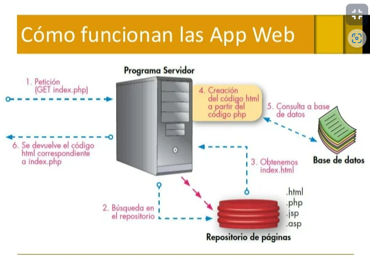

# Flask: framework de Python para crear App´s web

## ¿Como funcionan las aplicaciones web? 

Cuando utilizas una aplicación web puedes interactuar con ella desde una computadora hasta un dispositivo móvil, pero esto no quiere decir que consume el procesamiento de tu dispositivo. Todo lo contrario, se hace en una red de servidores.

Estos servidores unen su poder de procesamiento con el fin transmitir solicitudes a todo el mundo, a su vez utilizar servidores especializados para almacenar los datos con los cuales se está trabajando, así como los datos de los demás usuarios. Como todo esto sucede sin demora alguna, parecerá que la aplicación se está ejecutando de forma nativa en tu dispositivo.

El servidor procesa la información obtenida por el navegador, luego se realizan los procedimientos necesarios de acuerdo a la lógica de negocio de la aplicación para regresar la información solicitada al cliente.

Ejemplo:

Cuando utilizamos Google Drive el cual es una aplicación web y abrimos un documento con Google Docs, el navegador se comunica con los servidores para ver y editar el documento.

A medida que vayas editando el documento, tu navegador trabajará de la mano con los servidores para asegurarse que todos los cambios se estén guardando.

Ventajas:

Muchas de las aplicaciones web que existen son gratuitas.
Puedes acceder a tu información en cualquier momento y lugar.
No dependes de un dispositivo en específico ya que la aplicación se encuentra almacenada en la web.



## ¿Que es Flask? Microframework

Aca dejo mis apuntes de esta clase

Flask es un microframework hecho en Python el cual una de sus grandes ventajas es que es simple y facil de personalizar a medida que la aplicación crezca también las dependencias que se van a utilizar.

Algunas diferencias de con Django son:

- Utiliza un template llamado Jinja2 que esta inspirado en los Django Templates.
- Django es todo incluido mientras que Flask es lo más simple posible.
- Django tiene un módelo MVC mientras que Flask no tiene un módelo especifico es libre.
- Django tiene ORM mientras que Flask es más personalizable al trabajar con bases de datos.

--------------------------------------------

## Encendido de Flask

Ademas de la creación de un venv y la instalación de flask vía PIP en el mismo debemos crear unaa variable de entorno para que el comando **flask run** funcione. Eso lo hacemos con: 

En Linux/Mac:

```bash
export FLASK_APP=main.py
```

En Windows:

```bash
set FLASK_APP=main.py
```

------------------------------------------

## Modo debugger en Flask

**Flask** tiene un modo debugger que nos va a permitir salvar cambios y que los mismos impacten directamente en nuestra app sin necesidad de apagar y volver a prender el server. Es un similar al flag "--reload" de uvicorn que usamos cuando trabajamos con fastapi

Tenemos dos formas de hacerlo:

1- crear una variable de entorno: 

En Linux/Mac:

```bash
export FLASK_DEBUG=1
```

En Windows:

```bash
set FLASK_DEBUG=1
```

2- Otra opción para correr el servidor en modo debug es poner estas lineas al final del archivo main.py:

```python
if __name__ == '__main__':
    app.run(debug=True)
```
y correr main.py desde la terminal:

```bash
python main.py 
```

-----------------------------------------

## Request y Response:

Flask provee varios tipos de variables que no brindan el contexto de nuestra aplicación una de ellas es request.
Para ello primero debemos de import **request** de Flask.

```python
from flask import Flask, request
```

-----------------------------------------

## Ciclos de Request y Response:

Request-Response: es uno de los métodos básicos que usan las computadoras para comunicarse entre sí, en el que la primera computadora envía una solicitud de algunos datos y la segunda responde a la solicitud.

Por lo general, hay una serie de intercambios de este tipo hasta que se envía el mensaje completo.

Por ejemplo: navegar por una página web es un ejemplo de comunicación de request-response.

Request-response se puede ver como una llamada telefónica, en la que se llama a alguien y responde a la llamada; es decir hacemos una petición y recibimos una respuesta.

Vamos a crear una nueva ruta, guardar el IP del usuario en una Cookie y vamos a redirigir al usuario a la ruta de hello

-----------------------------------------

## Templates con Jinja 2:

¿Que son los templates? ¿Como renderizar archivos HTML en nuestra aplicación? 

Un templeate -> archivo de HTML -> renderiza informacion: Estatica o DInamica -> por variables -> luego nos muestra en el navegador

Para renderizar un template/plantilla creada con Jinja2 simplemente hay que hacer uso del método render_template.

A este método debemos pasarle el nombre de nuestra template y las variables necesarias para su renderizado como parámetros clave-valor.

Flask buscará las plantillas en el directorio templates de nuestro proyecto. En el sistema de ficheros, este directorio se debe encontrar en el mismo nivel en el que hayamos definido nuestra aplicación. En nuestro caso, la aplicación se encuentra en el fichero main.py.

Es hora de crear este directorio y añadir las páginas main.html, La estructura de nuestro proyecto quedaría del siguiente modo:

```bash
Flask-proyect
|_main.py
|_ /templeate
    |__ hello.html
```
Ejemplo archivo main.py

```py
from flask import Flask, request, make_response, redirect, render_template

app = Flask(__name__)

@app.route('/')
def index():
    user_ip = request.remote_addr
    response = make_response(redirect('/hello_world'))
    response.set_cookie('user_ip', user_ip)

    return response

@app.route('/hello_world')
def hello_world():
    #creamos nueva variable de la ip que detectamos en el browser
    user_ip = request.cookies.get('user_ip')

    return render_template('hello_world.html', user_ip= user_ip)
# metodo es render_template con jinja2 y la variable es user_ip.
```

Con los templates podemos, por ejemplo, en lugar de regresar (return) un string del tipo "Hello World..." regresar un archivo .html

--------------------------------------------------

## Estructuras de control y for loops en los templates:

**Iteración**: es la repetición de un segmento de código dentro de un programa de computadora. Puede usarse tanto como un término genérico (como sinónimo de repetición), así como para describir una forma específica de repetición con un estado mutable.

Un ejemplo de iteración sería el siguiente:

```html
<!-- Ciclo for en template HTML -->
<ul>
    
        <li>{{todo}}</li> 
        
</ul>
```

Un ejemplo de condicional sería este:

```html
<!-- Condicionales en template HTML -->

    <h2>Hello World, tu Ip es {{user_ip}} </h2>

    <a href="{{ url_for('index') }}">Ir a inicio</a>
 
```
